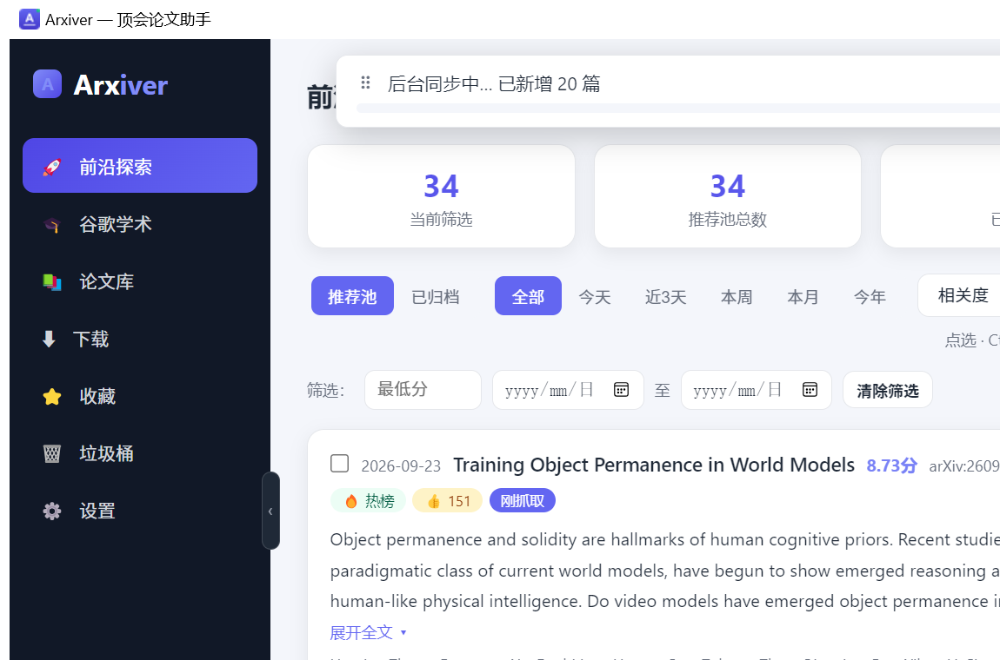

# Arxiver · 顶会论文追踪助手

> 面向计算机专业研究生：每天替你从 arXiv / HuggingFace 热榜里筛出该看的论文，按你的研究方向打分，一键下载并按「方向/年份」重命名归档。

   

## 界面



左侧是前沿探索 / 谷歌学术 / 论文库 / 下载 / 收藏 / 垃圾桶，右侧一屏看完：顶部统计卡（当前筛选、推荐池总数）、时间窗与相关度筛选，下面是打分排序后的论文卡片（分数、来源徽章、摘要可展开）。

每天刷 arXiv 新列表是件很奢侈的事。Arxiver 的思路是：**多源抓取 → 去重 → 按画像打分 → 入库 → 可选自动下载**，把「今天有什么值得看」压缩成一次通知。

## 功能

| 需求 | 实现 |
| --- | --- |
| 轻量桌面 exe | pywebview（复用系统 WebView2，不额外带运行时）+ PyInstaller 单文件；首次启动可自动创建带 logo 的桌面快捷方式 |
| 开机自启 | 注册表 `HKCU\...\Run`，无需管理员权限；`--minimized` 直接进托盘 |
| 研究方向画像 | 大方向 = arXiv `cs.*` 分类（内置 33 个常用分类的中文名）；小方向 = 每个大方向下的关键词 + 种子论文，收藏即自动加入种子 |
| 日 / 周 / 月 / 年推送 | APScheduler 定时任务：日报（arXiv 新论文 + HuggingFace 热榜）、周报（本周最热）、月报/年报（OpenAlex 引用数 Top） |
| 下载与归档 | 文件名 `{标题}_{arXivID}.pdf`，`? ! : * " < > / \ |` 全部替换为中文全角，超长截断但保留 ID；按「大方向/年份」落目录 |
| 不卡死 | 全局异常钩子：写日志 + 非阻塞弹窗（带冷却防刷屏）；网络请求指数退避重试；同步逐批增量入库并推送界面，不用等全部跑完 |

## 数据源（全部免费，无需注册）

| 源 | 用来做什么 |
| --- | --- |
| [arXiv API](https://info.arxiv.org/help/api/index.html) | 新论文列表与元数据 |
| HuggingFace Daily Papers | 每日热榜与 upvotes |
| Semantic Scholar | 种子论文相关推荐、引用数 |
| OpenAlex | 月/年「最重要工作」排序 |

## 开发运行

```powershell
python -m venv .venv
.venv\Scripts\pip install -r requirements.txt
.venv\Scripts\python -m arxiver               # 打开窗口
.venv\Scripts\python -m arxiver --minimized   # 后台托盘模式
```

打包：`build.bat` → `dist\Arxiver.exe`。想换图标改 `arxiver/icon.py` 后跑 `python assets\make_icon.py`（托盘图标与 exe logo 共用）。

## 测试

`tests/` 下 15 个脚本，`python tests/run_all.py` 跑九层校验（单元 → 接口 → 界面 → 真 exe 启动）。多数是脚本式断言而非 pytest，便于直接看输出。

```bash
python tests/run_all.py
```

## 数据存储

```
~/.arxiver/                 # 可用环境变量 ARXIVER_HOME 覆盖
├── config.json             # 研究画像与设置
├── library.db              # SQLite 论文库
├── logs/arxiver.log
└── library/                # PDF 归档：{大方向}/{年份}/{标题}_{ID}.pdf
```

CCF 推荐目录已被烘焙成 `arxiver/core/ccf_venues.py` 里的静态表，运行时不依赖任何外部 PDF 文件。

## 项目结构

```
arxiver/
├── arxiver/
│   ├── app.py                # 入口：托盘 + 窗口 + 调度
│   ├── config.py             # 配置与画像持久化
│   ├── paths.py              # 数据目录管理
│   ├── tray.py               # 系统托盘
│   ├── core/
│   │   ├── clients/          # arxiv / hf_daily / semantic_scholar / openalex
│   │   ├── pipeline.py       # 抓取→去重→打分→入库→下载
│   │   ├── recommender.py    # 画像打分
│   │   ├── ccf_venues.py     # CCF 推荐目录静态表
│   │   ├── downloader.py     # 下载 / 重命名 / 归档
│   │   ├── library.py        # SQLite 论文库
│   │   ├── scheduler.py      # 日/周/月/年定时任务
│   │   ├── notifier.py       # Windows Toast 通知
│   │   └── errors.py         # 全局异常钩子 + 重试
│   └── ui/                   # pywebview 窗口与前端
├── tests/
├── run.py                    # PyInstaller 入口
└── build.bat
```

## 与其他项目的关系

科研的**进度管理**（六步路线、投稿目标、DDL）不在本工具里做，那是 [Life System](https://github.com/Umbrellalalala/life-system) 的「科研管理」页负责的事，它只读地接入本工具的 `library.db`。Arxiver 只管一件事：**把论文抓到你的硬盘上并整理好**。

## License

[MIT](LICENSE)

---

如果它帮你省下每天早上刷 arXiv 的时间，**点个 Star** ⭐ 想要支持的新数据源、新分类，开 [Issue](https://github.com/Umbrellalalala/arxiver/issues)。
